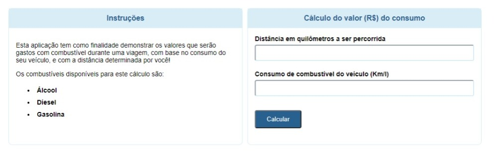

# Cálculo de consumo de combustível
## Projeto criado no curso da devmedia.

 
 

---

---
## 🌟 Tecnologias 

Projeto foi desenvolvido com as seguintes tecnologias

- [php](https://www.php.net/)
- [HTML](https://www.w3schools.com/html/html_intro.asp)
- [CSS](https://www.w3schools.com/css/css_intro.asp)

---

criado por Anderson Jorge,  em Janeiro de 2022.